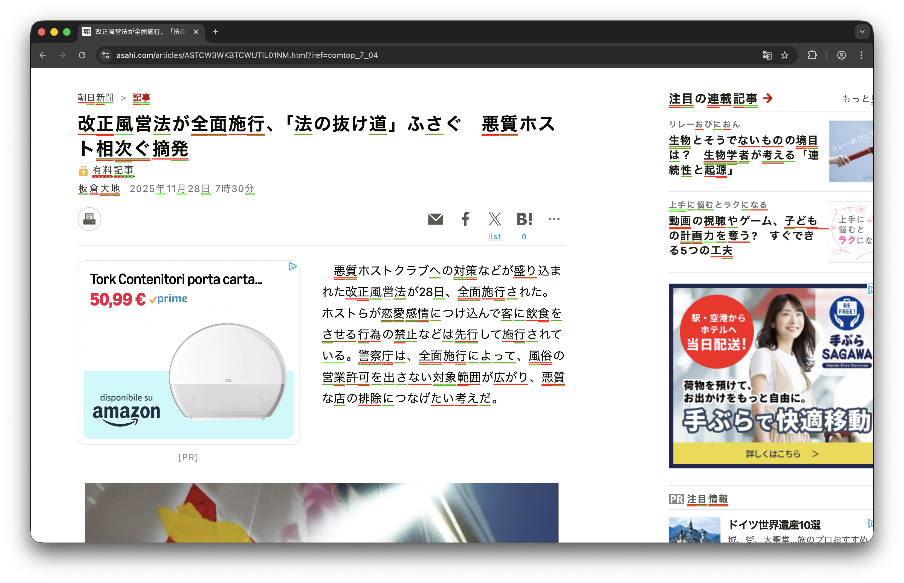
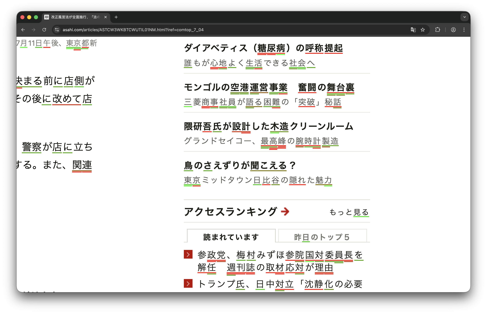

Over the past year I have been intermittently memorizing over a thousand kanji and a few thousands of Japanese vocabulary words. Although I often struggled to gauge my reading comprehension—some words I knew well, others I had never seen—out of frustration I spent an evening coding a Chrome extension that loads your Anki deck and immediately lets you visualize your progress in reading comprehension. In simple terms, words you know well are underlined in green, while those you know less well in red. Available now on my GitHub at this [link](https://github.com/ghovax/AnkiLevels). Free for anyone to use as they please under any permissive license that may apply.

### How Does It Work?

The card data is fetched from Anki via the Anki Connect extension. Once per day, this data is processed to obtain each card's statistics—interval, lapses, and repetitions—and to calculate a difficulty level ranging from 0 to 100. These data are then used to highlight words on the page. The extension defaults to the deck called "Japanese," but that can be customized in the code.

The "interval" indicates the number of days until the card is next due for review. "Lapses" indicates how many times you have forgotten a given card. "Repetitions" is the total number of views. The "ease factor" reflects, in Anki’s internal statistics, how easily you remember the card. Interval is the most important parameter because a longer interval indicates a stronger memory for that specific word or character. An interval of six months (180 days) is associated with long-term memory, while a one-day interval means the item was just learned and is likely to be forgotten. To convert interval into a normalized score from 0 to 100, assign ranges based on retention duration: 90–100 for intervals of six months or more; 75–90 for three to six months; 50–75 for three weeks to three months; 30–50 for one to three weeks; and 10–30 for one week or less:

$$
\text{intervalScore}(i) = \begin{cases}
90 + \min\left(\frac{i - 180}{365}, 1\right) \cdot 10 \quad & \text{if } i \geq 180 \\
75 + \frac{i - 90}{90} \cdot 15 & \text{if } 90 \leq i < 180 \\
50 + \frac{i - 21}{69} \cdot 25 & \text{if } 21 \leq i < 90 \\
30 + \frac{i - 7}{14} \cdot 20 & \text{if } 7 \leq i < 21 \\
10 + \frac{i - 1}{6} \cdot 20 & \text{if } 1 \leq i < 7 \\
0 & \text{if } i < 1
\end{cases}
$$

This is a piecewise linear function: progress in memorization is not linear. A one-week interval indicates the information is established in short-term memory; three weeks marks a transition to medium-term memory; three months represents a solid medium-term memory. Six months means it has entered long-term memory and can be freely recalled. 

The interval score is clearly not the only metric that should be considered. I also assign a score to lapses and apply a penalty, because mistakes indicate difficulty:

$$
\text{lapsesScore}(l) = -\min(l \cdot 5, 25)
$$

The reasoning behind this formula is that each lapse subtracts five points from the score, capped at a maximum loss of 25 points. This is intentionally lenient because occasional lapses are normal, especially with difficult words or characters, and a single mistake should not drastically reduce the score.

Then there are repetitions, which provide a bonus: reviewing a card multiple times signals engagement and helps distinguish truly new cards that have never been reviewed from younger ones that have only recently begun to be reviewed:

$$
\text{repsBonus}(r) = \begin{cases}
\min(r \cdot 2, 10) & \text{if } r > 0 \\
0 & \text{otherwise}
\end{cases}
$$

The final score indicating difficulty is obtained by summing all of these scores and clamping the result between 0 and 100, producing a single number that reflects how well each word is known based on my actual learning history:

$$
\text{difficultyLevel} = \max(0, \min(100, \text{intervalScore} + \text{lapsesScore} + \text{repsBonus}))
$$

This score is then used as input to the text-highlighting algorithm. 

### Text-Highlight Algorithm

If we search for the words or characters from our deck within a web page, multiple substrings may match. This is particularly evident in Chinese and Japanese, where words are not separated by spaces and their reading order, and also possible compounds create many overlaps. Simply highlighting the longest match would obscure information about shorter words; the user should be able to see their knowledge about individual characters and compounds. My solution is a tree-like structure: the algorithm first highlights the primary, longest match, corresponding to the compounds, then adds color-coded underlines for all overlapping words, stacking them vertically to avoid visual overlap and collision.

The color scheme maps the difficulty levels to a red to green gradient. Red indicates low difficulty words, high difficulty words, meaning those with a low score, while green indicates mastered words, those with a higher score. The formula used specifically is the following one:

$$
\text{color}(d) = \text{rgb}\left(\left\lfloor 255 \cdot \left(1 - \frac{d}{100}\right) \right\rfloor, \left\lfloor 255 \cdot \frac{d}{100} \right\rfloor, 0\right)
$$

where $d$ is the difficulty level within the interval $[0, 100]$.

This formula produces a smooth gradient: a score of 50 and a difficulty score of 50 yield yellow, while a score of 25% yields orange. The text highlight is shown in the following image with more detail.

In the last image, many words appear with multiple matches; the entire words are not known, but shorter compounds of its characters are, and the algorithm correctly reflects this, concurrently highlighting without creating visual clutter.