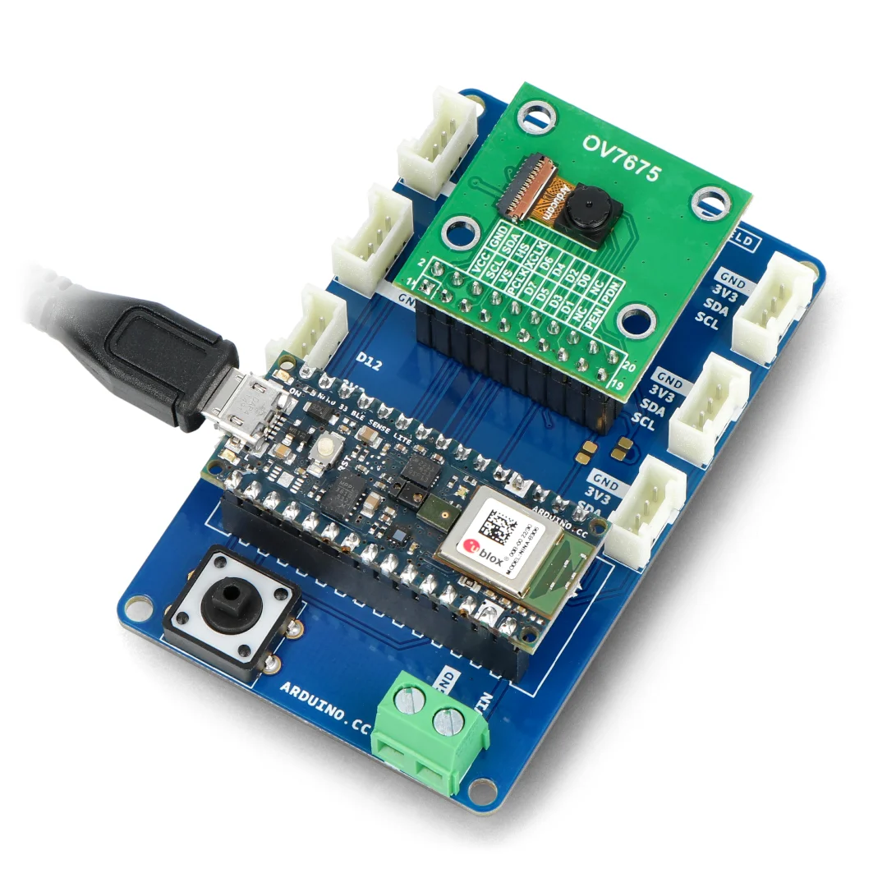

For my Electronics for Applied Physics exam, I completed a master's project using an Arduino Nano 33 BLE Sense with its camera module to capture images that were fed into a Convolutional Neural Network (CNN) trained on the MNIST dataset. The work involved interfacing with the camera module, handling serial communication protocols, preprocessing the images, and running model inference on my machine. The main technical challenge was integrating these components reliably, since any point could fail and debugging proved difficult; by implementing custom debugging and logging, I succeeded in the implementation. The code is available at this [link](https://github.com/ghovax/mnist_vision).

### Serial Communication and Arduino Integration

My implementation relied on the Arduino serial module to capture pixel grayscale images by sending capture commands over the serial port, triggering the camera to capture a frame into a buffer and stream the raw frame data back over serial. The OV7670 camera module produces 176×144 pixel grayscale images, which amounts to 25,344 bytes per frame. Transmitting this volume of data over serial at 115200 baud requires careful buffer management to avoid timeouts and data corruption. The Arduino sketch captures the frame into an internal buffer and then streams it byte-by-byte over the serial connection, with the Python server reading and reassembling the raw pixel data into a NumPy array.

One significant challenge was ensuring reliable serial communication. The Arduino Nano 33 BLE Sense uses a virtual serial port over USB, which can be unpredictably enumerated by the operating system. To address this, I implemented an automatic port detection function that scans all available serial ports and identifies the Arduino by checking for "Arduino" or "usbmodem" in the port description. Once a candidate port is found, the function attempts to open a test connection to verify it responds correctly before considering it valid. This approach eliminates the need for manual port configuration and makes the system more robust to USB enumeration changes.

### Flask Server Architecture

To interface with the Arduino and simplify the process, I implemented a Flask-based Python server that manages the connection, abstracts low-level operations into Python arrays, and prepares the data for processing. The server maintains a global `serial_connection` object protected by a thread lock to ensure that only one request can communicate with the Arduino at a time. This is critical because serial communication is inherently sequential; if two requests attempted to send commands simultaneously, the response data would be interleaved and corrupted.

The image capture process is orchestrated by the `acquire_image` function, which performs several steps in sequence: first, it checks whether the Arduino sketch has been modified since the last compilation by computing a SHA-256 hash of the source file and comparing it to a cached value. If the sketch has changed, or if the user explicitly requests a recompilation, the function invokes the Arduino CLI to compile the sketch and flash the firmware. After flashing, the server waits for the Arduino to reset and re-enumerate on the USB bus, then re-establishes the serial connection. Only after this process completes does the function send the capture command and read the image data.

This automatic compilation and flashing system proved invaluable during development because it eliminated a common source of bugs: forgetting to upload modified code before testing. The server always ensures that the running firmware matches the source code on disk, which provides a strong guarantee that observed behavior reflects the current implementation rather than a stale version.

### Image Processing Pipeline

Processing begins by thresholding the image to create a transparency mask—lighter pixels become transparent while darker pixels remain—then resizing the image to $28 \times 28$ to match the CNN model trained earlier. The thresholding step is necessary because the camera captures background noise and varying lighting conditions, which can confuse the model. By setting a threshold of 100 (on a scale of 0 to 255), pixels brighter than this value are converted to fully transparent, while darker pixels are retained as opaque. This creates a binary mask that isolates the handwritten digit from the background.

In addition to matching the model's input size, pixel values are normalized to the $[0, 1]$ range and colors inverted to match the white/black convention of the dataset. The MNIST dataset represents digits as white strokes on a black background, but the camera captures dark strokes on a light background. To account for this, the preprocessing pipeline inverts the pixel values by computing $1 - x$ for each normalized pixel $x$. This ensures that the input distribution matches the distribution the model was trained on, which is critical for accurate predictions.

The resizing operation uses bilinear interpolation, which provides a good balance between quality and performance. After resizing, the image is converted to a single-channel grayscale array and expanded to shape $(1, 28, 28, 1)$ to match the CNN's expected input format: batch size of 1, height 28, width 28, and 1 color channel.

### Next.js Web Interface

The user interacts via a Next.js web interface rather than directly with the Flask API; the interface provides real-time visualization and interactivity, allowing connection, disconnection, capture, and display of the model's prediction probabilities across all 10 digits as a bar chart, giving immediate feedback on what the model sees and how confident it is. The web interface communicates with the Flask server via HTTP requests and displays the captured image as a base64-encoded PNG, which is rendered in the browser alongside the probability distribution.

The interface also includes a live logging panel that streams messages from the Flask server, allowing the user to monitor the capture process in real time. This proved essential for debugging because it provides visibility into each step: port detection, sketch compilation, firmware upload, serial connection establishment, and image reception. Errors at any of these stages are logged with timestamps and severity levels, making it straightforward to diagnose issues.

### Arduino CLI Integration

Rather than using the Arduino IDE, I integrated the Arduino CLI into the workflow. The command detects if the sketch has been modified; if so, the server automatically recompiles the code and flashes the updated firmware before attempting to capture images, preventing debugging issues and ensuring the system is always in the expected valid state. The Arduino CLI is invoked via Python's `subprocess` module, with the compilation and upload commands executed synchronously to ensure each step completes before proceeding to the next.

The compilation step uses the fully qualified board name (FQBN) `arduino:mbed_nano:nano33ble` to specify the target hardware, and the output is written to a `build` directory in the project root. The resulting hex file is then uploaded using the `arduino-cli upload` command, which automatically detects the bootloader and flashes the firmware. This process typically takes 10-15 seconds, during which the server blocks incoming capture requests to prevent race conditions.

After flashing, the serial connection must be re-established because the Arduino resets during the upload; this is handled automatically by first closing any existing connection before flashing and then waiting for the Arduino to enumerate on the USB bus again. The port detection function is called again to locate the Arduino, and a new serial connection is opened with the appropriate baud rate and timeout settings. This automatic recovery mechanism ensures that the system remains operational even after firmware updates.

Unfortunately I have no pictures of the device, as it needed to be returned to the professor, but here's what it looked like:

### Training the CNN Model

The digital recognition model is a standard CNN trained on the MNIST dataset. 

* **Input:** $(28, 28, 1)$

For feature extraction it comprises two convolutional blocks...

* **Conv2D:** $32$ filters, $3 \times 3$ kernel, ReLU$\rightarrow (26, 26, 32)$
* **MaxPooling2D:** $2 \times 2$ pool$\rightarrow (13, 13, 32)$
* **Conv2D:** $64$ filters, $3 \times 3$ kernel, ReLU$\rightarrow (11, 11, 64)$
* **MaxPooling2D:** $2 \times 2$ pool$\rightarrow (5, 5, 64)$
* **Flatten:** Converts to $1D$$\rightarrow (1600)$
    
...followed by a classifier of fully connected layers with dropout for regularization to prevent overfitting. The data are augmented with an image generator that randomly rotates images up to 30 degrees and shifts them horizontally and vertically by up to $\pm 20\%$, which improves robustness when the digit is misaligned during camera acquisition. The model is saved as a Keras file that the Flask server loads for inference at runtime.

* **Dense:** $128$ units, ReLU, $\ell_2(0.01)$ regularization
* **BatchNormalization**
* **Dropout:** Rate $0.2$
* **Dense:** $32$ units, ReLU, $\ell_2(0.01)$ regularization
* **BatchNormalization**
* **Dropout:** Rate $0.2$
* **Dense (Output):** $10$ units, softmax activation

The training process uses the Adam optimizer with an initial learning rate of 0.001, which decays by 10% every epoch after the tenth epoch. This learning rate schedule prevents the model from overshooting the optimal weights in the later stages of training. I also implemented early stopping based on validation loss to prevent overfitting; if the validation loss does not improve for five consecutive epochs, training terminates and the best weights are restored. After 15 epochs, the model achieves a test accuracy of approximately 98.5% on the standard MNIST test set, which is sufficient for real-time digit recognition.

### Challenges and Debugging

One of the most frustrating aspects of this project was debugging failures in the serial communication pipeline. When the Arduino failed to respond, it was unclear whether the issue was in the camera initialization, the serial protocol, the buffer management, or the Python code. To address this, I implemented a comprehensive logging system that records every step of the capture process with timestamps and severity levels. The logs are stored in a thread-safe queue and periodically flushed to the console and the web interface, providing real-time visibility into the system state.

Another challenge was ensuring that the camera module was correctly initialized. The OV7670 camera requires a specific sequence of I2C commands to configure its registers, and any deviation from this sequence results in corrupted images or no output at all. I spent several days troubleshooting initialization issues before discovering that the camera required a brief delay after power-on before accepting configuration commands. Adding a 100ms delay resolved the issue and made the system reliable.

The combination of automatic compilation, robust error handling, and comprehensive logging transformed what initially seemed like an insurmountable debugging challenge into a manageable workflow. By the end of the project, I could modify the Arduino sketch, save the file, and immediately test the changes without manually invoking the compiler or upload tool. This tight feedback loop significantly accelerated development and allowed me to focus on improving the recognition accuracy rather than wrestling with tooling.