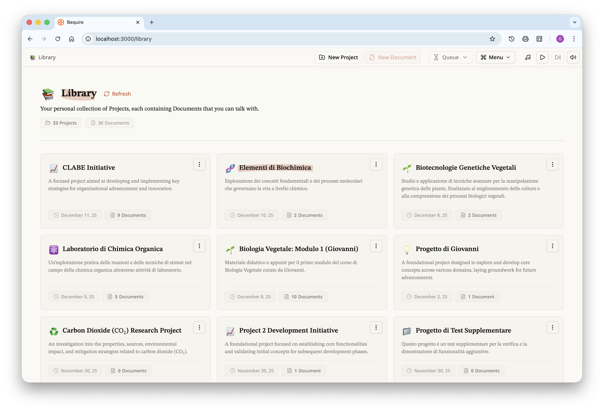
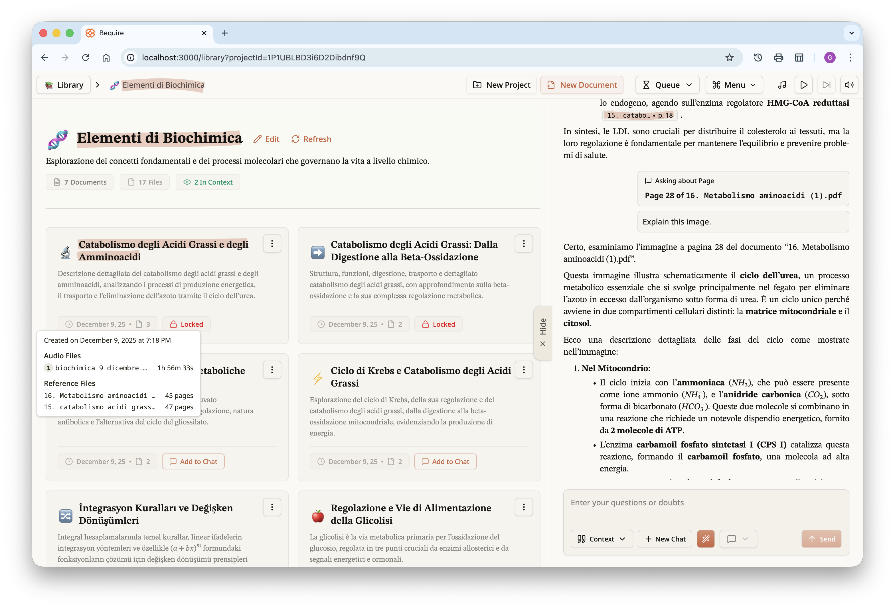
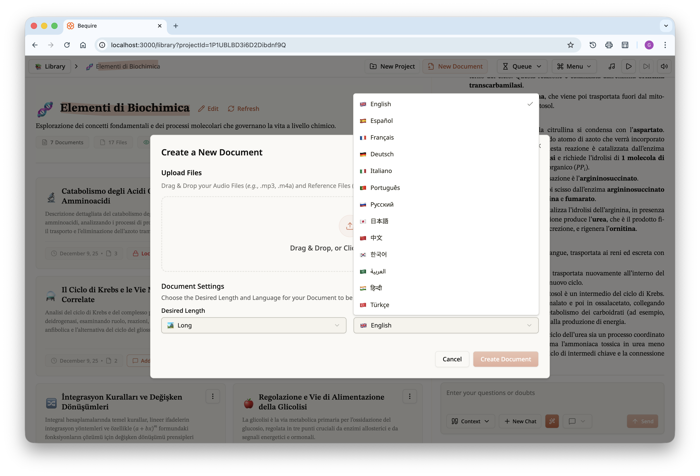
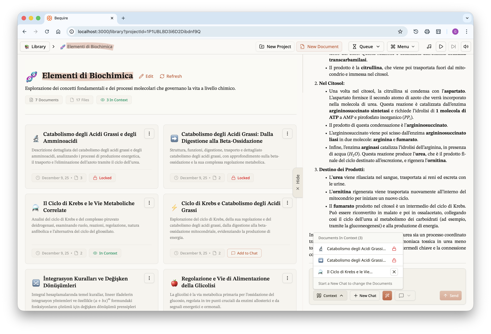
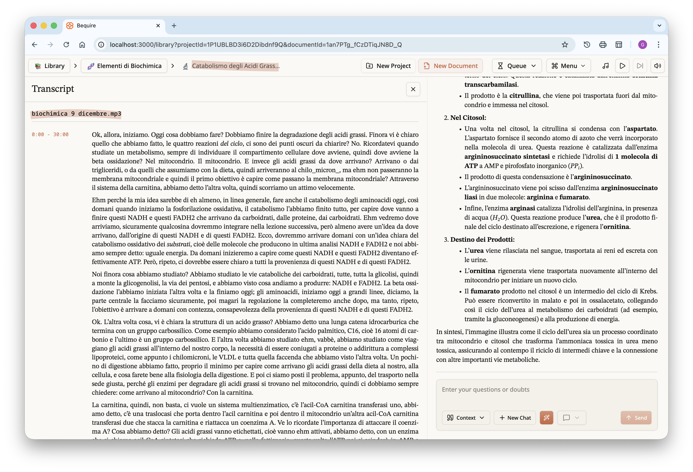
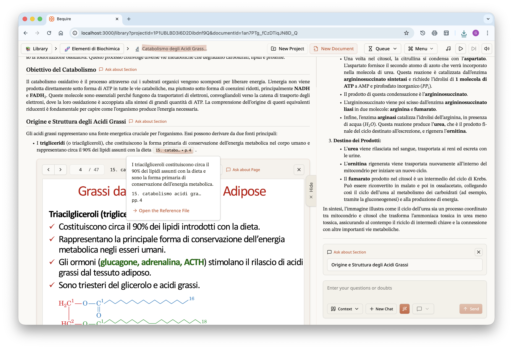
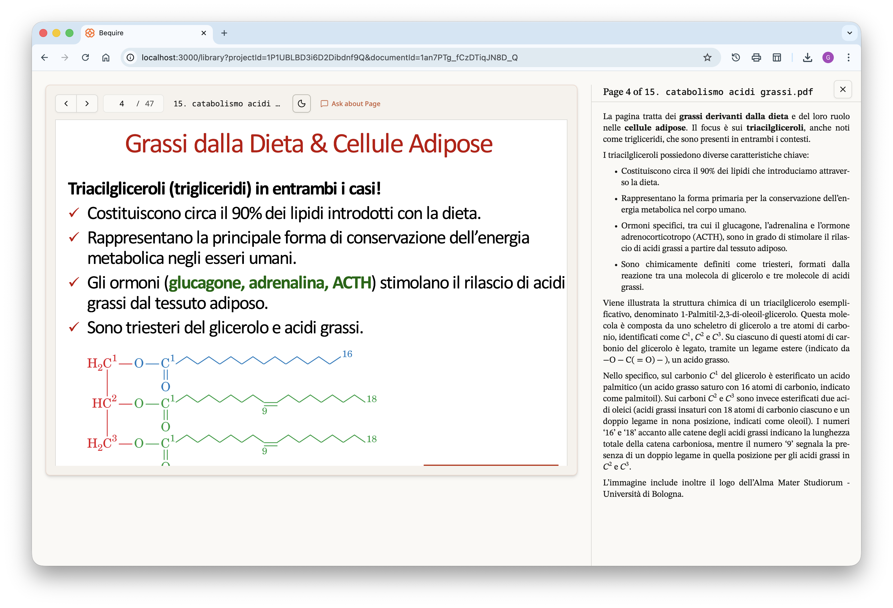
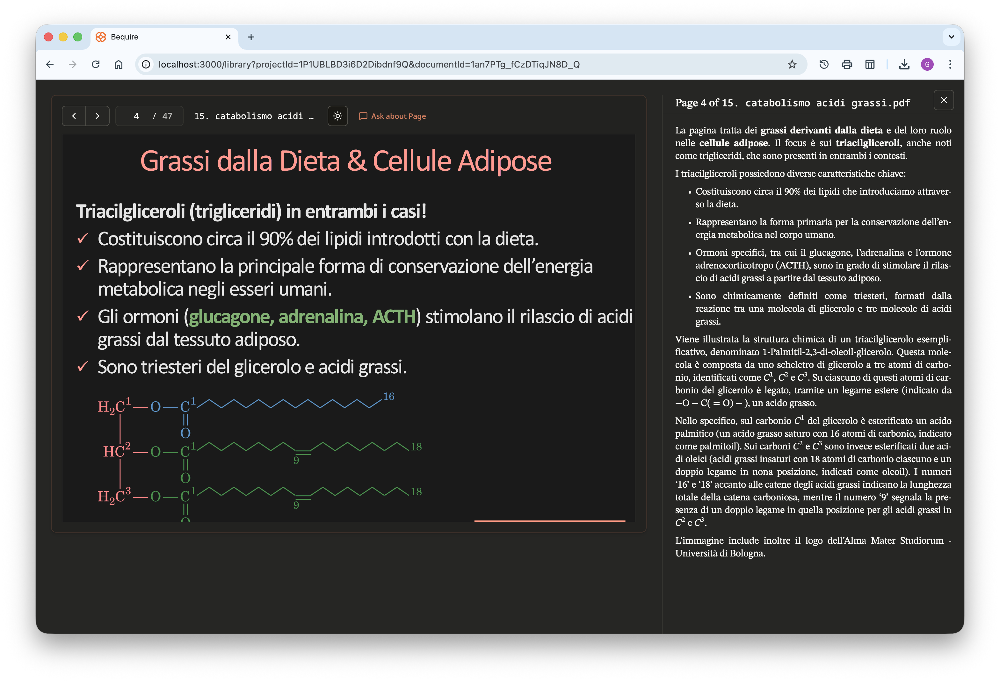
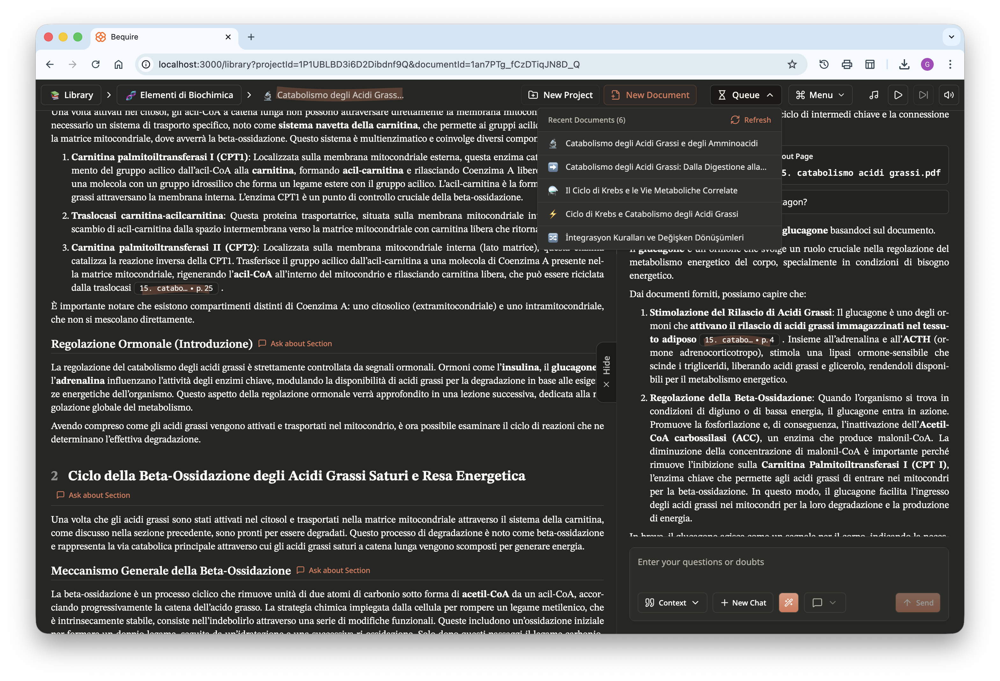

While the demand for advanced LLM-based tools at the academic level is clearly present, there is a significant lack of services and solutions that properly address the needs of university students and educators. This deficit is most pronounced in the processing, organization, and clean-up of lecture materials into high-quality, reliable study resources starting from unstructured sources such as recordings and lecture slides.

Currently, most programs and apps that attempt to utilize Large Language Models (LLMs) for this purpose are merely superficial and naïve wrappers around existing LLM APIs. I believe these approaches are clearly not suited for academic use because they lack the depth of explanation and reasoning, often condensing multiple hours of lecture by a professor into a small number of bullet points; while they do capture the overall aspect of the lectures, they miss in the subtleties, and we all know the devil is in the details. The core issue is that academic content is characterized by a high density of information. LLMs, by default, act as lossy encoders: they shorten and summarize, causing a vital loss of information over long-form content that can be critical for passing exams and effective study. Furthermore, simple repeated prompting does not resolve this issue because it does not permit the reliable verification or structural organization necessary for accurate, comprehensive study material.

This necessity for a better solution became clear to me this past March when I was talking with one of my roommates. He was trying to study for an exam by feeding his slides, documents, and lecture recordings to an LLM. He tried public-facing platforms like ChatGPT and then Gemini, but quickly found they were limited because they cannot be programmed. The intuitive next step is to access these services via the API, feed the source materials, and request a study document or ask questions.

However, even this seemingly logical "naïve" approach fails for multiple reasons, particularly with lecture recordings. Typical lectures span one to three hours. Yet, from my testing—even with advanced models such as Gemini 2.5, Gemini 3, and GPT-5—the models can coherently transcribe audio for only about 30 to 40 minutes before they begin hallucinating (*i.e.*, repeating segments of their response nonsensically). Feeding hours of audio directly is also prohibitively expensive, as audio token pricing is often an order of magnitude higher than text tokens. One might argue that a multimodal model could directly summarize audio without a transcript, but this is also unscalable for multi-hour recordings, degrades with increasing length, and offers none of the granularity, checks, or verifications needed to ensure the consistency necessary for academia. Therefore, I developed a layered algorithm that can produce a cohesive document from slides and recordings together, spanning hundreds of pages and dozens of hours, by carefully processing the materials step by step.

Not only did I implement the algorithm, but I also created a platform called "Bequire" where users can sign up. It is not yet released to the public, but I have included snapshots showing how it looks and works. Currently it is in the testing phase with a very limited number of users having access; if you wish to join the testing, you may write to me at the email address [`giovannigravili112@gmail.com`](mailto:giovannigravili112@gmail.com).

This post is about how the algorithm works, the challenges I faced during implementation, the development of the web platform, and practical lessons about LLMs from my months of testing and experimentation. Let's not get ahead of ourselves; the most important part of this post is the algorithm itself, which underlies everything I will discuss.

### The Core Algorithm

The inputs can be audio files or reference materials such as slides, presentations, or articles, and the system accepts either audio only, reference files only, or both together; behavior varies depending on the combination. The algorithm produces a polished, well-structured document with proper citations where possible, equations, and a hierarchical organization. This constitutes the outline of the algorithm.

Due to current LLM limitations, audio files are split into approximately ten-minute segments so the AI can focus on one segment at a time; each segment’s transcription can be run separately, making the operation massively parallelizable. Because individual segment transcriptions are not polished, a secondary cleaning step is required: batches of two or three segments are processed together by another LLM-based step that cleans grammar, syntax, and logic while preserving the nature of the transcription. The resulting batches, processed in parallel, are then concatenated to form the entire transcript. This process is cost-effective by leveraging the full array of Gemini models, particularly the lower-tier ones; in my experience, larger models do not justify their higher price, since lower-end models still perform well on short segments. One obvious issue is speaker attribution: because segments are not processed sequentially, the algorithm cannot reliably draw boundaries for speakers across segments and may lose context between segments. However, the cleanup operation mitigates these problems sufficiently while keeping costs low enough for the product to be market-viable. The outcome of this first processing stage is a transcription with rough timestamp data for the different audio files.

Once the audio files are correctly transcribed, each individual page of the reference documents—slides, presentations, and so on—is independently and in parallel interpreted by the LLM using the image-understanding modality: each page is converted to an image and then fed to the model along with a prompt requesting its interpretation. The content is organized by explicitly marking each page in subsequent prompts and algorithmic steps, thereby preserving metadata such as page association. This process creates a corpus of source materials composed of the full lecture transcript and all extracted reference-file content. Next, it is essential to determine which pages of the reference materials are actually relevant to the lecture; this step reduces costs and lowers the model’s cognitive load by eliminating the need to discern relevance during interpretation. Specifically, only pages that support or explain concepts discussed in the lecture are selected.

This concludes the preparation of the source materials. The next step is performing a structure analysis, in which, rather than generating the entire study document in one massive prompt, the LLM is first asked to create an outline of the document in sections. For each section it should identify the topics and their relevance in the lecture, indicating how much the professor emphasized and prioritized them; determine appropriate section boundaries; establish a title; state what the section introduces and what it connects to—*i.e.*, what it builds on, what to cite and which topics have already been discussed and therefore should not be repeated. Each section is then provided as a new context to the LLM, which generates the document section by section. This process avoids forcing the LLM to compress information and instead allows expansion of specific parts of the lecture without limits. The algorithm is designed so that we may ask the LLM to generate an arbitrary number of sections and thus expand each individually to obtain the desired level of precision on each topic. After the generation of each section, a verification runs that produces a score indicating the section's adherence to the required content and instructions. If the score does not meet the threshold, the generated section is discarded from the LLM context to prevent context pollution, and the section is regenerated until the threshold is met.

### Technical Difficulties

The output of LLMs, even if it resembles Markdown, must be considered unsanitized because it can be partly invalid. For example, lists may lack proper indentation, and LaTeX formulas embedded within the document may not be parsed correctly due to unsupported LaTeX commands, improperly delimited math environments (missing opening or closing delimiters), or the use of dollar signs for currency that interfere with formula parsing. This situation required creating a self-correcting Markdown parser and a custom citation format that the parser interprets; the citation format must be viewable on the web and ultimately parsed into valid HTML, so my implementation of the parser always produces valid HTML. Although it has not undergone fuzz testing, repeated document generation has revealed no major issues. Another problem LLMs often produce—problematic footnotes—was addressed by introducing the custom citation format. 

Even after extensive quality assurance, documents still exhibit occasional issues such as malformed LaTeX equations and imperfect citations, which highlight the limitations of current LLMs. Many of these problems require improvements to the underlying technology. Despite these shortcomings, independently conducted assessments by multiple testers on my platform found the generated documents to be incredibly helpful in preparing for exams across disciplines including chemistry, statistics, physics, economics, and medicine. Small formatting inconsistencies and other minor errors underscore the unpredictable nature of LLMs and indicate they should not be fully relied upon; such tools should be regarded only as study aids, not as replacements of existing study methods.

### The "Bequire" Platform

Over the past months I developed a web platform that enables users to run the algorithm; it is responsive across all screen sizes and includes accessibility options. After signing up, a user can create projects, which are defined as collections of documents produced by the algorithm. A project functions not just as a folder but as a scoped grouping: users can gather documents from different lectures belonging to the same class and query all those documents simultaneously through a chat interface. The list of projects is presented on what I call the library page.

Once a user selects a project, they are given the documents within it and access to the chat interface for all documents in that project.

Documents can be created via the "New Document" button on the top bar. Users can upload audio and reference files, choose the order of the audio files, and in the future may be able to assign importance to reference files to prioritize them. Each document can have one of three lengths—short, medium, or long. Length varies according to source materials: a long document typically corresponds to about 20 PDF pages, a medium document is around 14–15 pages, and a short document ranges from 5 to 10 pages.

Each document includes metadata so the user can differentiate among the various created documents. For each document a title and description are generated automatically. Documents themselves these are immutable and, in the current version, can only be downloaded as a PDF in addition to being accessible on the platform itself.

On the right, the chat panel can be collapsed or revealed via a toggle. The chat input at the bottom contains multiple utilities, including a view of which documents are currently in the context, creation of a new chat, and an autocorrect feature for messages that facilitates input of formulas via plain text. This feature not only corrects formulas but also grammar and syntax. The user can choose a response style that is balanced, concise, or oriented toward guided learning, allowing you to focus on the desired experience.

Once the document is accessed, it displays an interactive table of contents at the top and the chat panel associated with the project on the right. The document is automatically added to the chat context and can be queried immediately. 

The document, as previously noted, can be downloaded in PDF form; for those curious, I have uploaded it to Google Drive and it is available at the following [link](https://drive.google.com/file/d/1AchKmkigQVG6NGr7cOH0qRRjYY5eLcn9/view?usp=sharing).

Each document also includes a transcript; this cleaned, and roughly time-stamped version is the one used by the LLM in creating the document.

By scrolling down, the rest of the document can be read. If reference files have been provided, as in this case, citations will be present. These appear as footnotes in the PDF at the bottom of each page, but as clickable popups in the document within the website. Clicking a citation reveals the cited content, the referenced document, and the page where the content appears. Pressing the "Open the Reference File" button opens an inline view of the PDF at the specified page.

By scrolling further down, the user can see what the LLM has understood about each page; this comprehension is provided without any other context but may help the reader identify faults in the LLM's interpretation. Adding another verifiable step in the process can clarify misunderstandings: if something has not been properly understood, the user can press the "Ask about Page" button to pose a direct question to the LLM. Visual content is typically well interpreted by the LLM, and questions about diagrams or complex images can also be asked. Users can query entire pages or specific sections within the document by pressing the "Ask about Section" button next to each section header, making the website a superior medium for studying documents while still allowing accessibility through PDF download.

Focusing specifically on the last image above, a question was asked about the given page and the LLM responded by citing a specific piece of information from that page. This can occur for any general question that allows tracing, or approximate tracing, of information across multiple documents. By clicking the button in the pop-up, you can open the PDF reader and view the LLM’s understanding of each page in full-screen.

The user can freely navigate between the different pages, directly bypassing the document if desired and focusing specifically on the reference files they provided. The website is available in both light and full dark themes; the PDF files have the same dark-mode option to improve readability during night study sessions and reduce eye strain.

Lastly, here is another screenshot of the website in dark theme. In the top right, a queue shows documents being created that are accessible to users, and progress is displayed dynamically. A menu is available for users to choose different options, including zooming, selecting a theme, creating a new chat, printing the document, playing music, and signing out; users can play study or relaxing music freely available from YouTube directly within the website.

