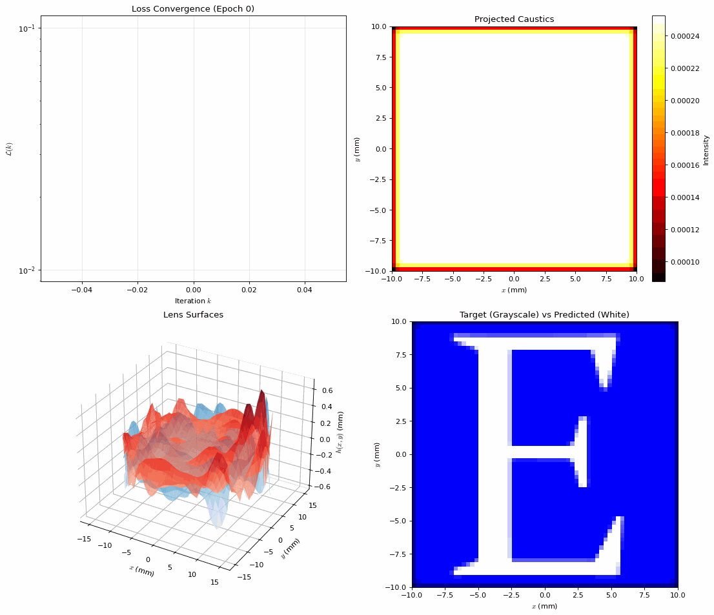

I've been learning PyTorch extensively and believe the best approach is to combine physics with machine learning. My goal in this article is to show how to model a lens while enforcing physical constraints, so it reproduces a custom pattern via caustics, that is, the rays of light passing through the lens and focusing in specific directions. This problem appears simple but conceals considerable mathematical complexity, which I will explain step by step. The code is publicly available at the following [link](https://github.com/ghovax/caustics_lens_pytorch).

The setup: a lens with a two free-form surfaces, thickness $t_{lens}$, and radius $r_{lens}$ is positioned at distance $d_{back}$ from a screen where the caustics are projected. The reference axis is defined so that the axis through the lens center is positive when moving away from the screen; thus $z = 0$ is the screen and increases toward the back of the lens. A parallel bundle of rays from infinity strikes the lens under geometric optics, so we treat light only by refraction (Snell's law), neglecting diffraction because the aperture is much larger than the wavelength. We seek the mathematical formulation, subject to physical constraints, for the front surface height $h_{front}(x,y)$ that produces the desired screen pattern; the lens is glass with refractive index $n_{lens} \approx 1.49$.

Given this setup, the goal is to ensure the surface distribution of light intensity projected by the lens shape $h_{front}(x, y)$ closely matches a specified target distribution, which is the pattern we intend to recreate. To do this, we must first understand, in practical terms, the formulas and procedures for tracking the positions of light rays as they propagate through the lens and project onto the screen.

First of all, the light rays come from infinity and all parallel, as a bundle, with a direction versor

$$\hat{d}_{in} = (0, 0, -1)$$

directed to the $z = 0$ of the projection surface. Each ray is coming from a specific point along the $x$ and $y$ axes, $x_{in}$ and $y_{in}$, respectively. They intersect the lens surface at a generic position

$$z_{front}(x, y) = d_{back} + t_{lens}+ h_{front}(x, y)$$

This makes the intersection point between the front surface of the lens given in coordinate space by

$$\vec{P}_{front} = (x_{in}, y_{in}, z_{front}(x, y))$$

To apply Snell's law, refracting the ray, we need to find the surface normal $\hat{n}_{lens}$ at that point, technically given by

$$\hat{n}_{front} = \frac{\nabla F}{\|\nabla F\|}$$

where

$$F(x, y, z) = z −(d_{back} + t_{lens} + h_{front}(x, y))=0$$

is the surface function. This means we need to calculate the gradients of the height function. Because we can express the height function in a differentiable form using Zernike polynomials, PyTorch automatic differentiation computes each component of the derivative, making the calculation trivial. Then, the ray passes from the front surface of the lens through the glass: Snell's law says that the direction of propagation of light within the glass lens, $\hat{d}_{lens}$, upon hitting the surface, is related the $\hat{d}_{in}$ by the refractive index of the glass, $\eta = \frac{1}{n_{lens}}$, as $n_{air} = 1$ by definition. Through geometric identities based on the dot product it's possible to derive that

$$\hat{d}_{lens} = \eta \hat{d}_{in} + \left(\eta \cos{\theta_{in}} - \sqrt{1 - \eta^2 \sin^2{\theta_{in}}}\right) \hat{n}_{front}$$

where

$$\cos{\theta_{in}} = -\hat{d}_{in} \cdot \hat{n}_{front}$$

After it's calculation, this needs to be normalized. To find where the ray hits the back surface of the lens, we need to solve the equation

$$z_{front} + t_{back} (\hat{d}_{lens} \cdot \hat{z}) = z_{back}$$

for $t_{back}$, which yields the intersection point

$$\vec{P}_{back} = \vec{P}_{front} + t_{back} \hat{d}_{lens}$$

At the back surface

$$z_{back}(x, y) = d_{back} + h_{back}(x, y)$$

a second refraction occurs as light exits the lens back into air. Again we apply Snell's law, but now the refractive index ratio is

$$\eta' = \frac{n_{lens}}{n_{air}} = n_{lens}$$

The back surface normal $\hat{n}_{back}$ is computed identically from the gradient of $h_{back}(x, y)$, and the refracted direction in air is

$$\hat{d}_{out} = \eta' \hat{d}_{lens} + \left(\eta' \cos{\theta_{lens}} - \sqrt{1 - \eta'^2 \sin^2{\theta_{lens}}}\right) \hat{n}_{back}$$

where

$$\cos{\theta_{lens}} = -\hat{d}_{lens} \cdot \hat{n}_{back}$$

Finally, the ray propagates from $\vec{P}_{back}$ in direction $\hat{d}_{out}$ until it hits the screen at $z = 0$. The screen intersection is simply

$$\vec{P}_{screen} = \vec{P}_{back} + t_{screen} \hat{d}_{out}$$

where

$$t_{screen} = \frac{0 - z_{back}}{\hat{d}_{out} \cdot \hat{z}}$$

The $(x, y)$ coordinates of $\vec{P}_{screen}$ determine where the ray contributes intensity to the caustic pattern.

### Zernike Polynomial Parameterization

The critical question is: how do we represent $h_{front}(x, y)$ and $h_{back}(x, y)$ in a form that is both differentiable and physically reasonable? The answer lies in **Zernike polynomials**, an orthogonal basis over the unit disk that are standard in optical surface description. A Zernike polynomial $Z_n^m(\rho, \theta)$ is indexed by radial degree $n$ and azimuthal frequency $m$, where

$$\rho = \sqrt{x^2 + y^2}/r_{lens}$$

is the normalized radial coordinate and

$$\theta = \arctan(y/x)$$

is the angular coordinate. The polynomial is defined as:

$$Z_n^m(\rho, \theta) = R_n^{|m|}(\rho) \times \begin{cases} \cos(m\theta) & m \geq 0 \\ \sin(|m|\theta) & m < 0 \end{cases}$$

where $R_n^m(\rho)$ is the radial polynomial:

$$R_n^m(\rho) = \sum_{k=0}^{(n-m)/2} \frac{(-1)^k (n-k)!}{k! (\frac{n+m}{2}-k)! (\frac{n-m}{2}-k)!} \rho^{n-2k}$$

Each surface is expressed as a weighted sum:

$$h(x, y) = \sum_{i} c_i Z_{n_i}^{m_i}(\rho, \theta)$$

where the coefficients $c_i$ are the learnable parameters optimized by PyTorch. For instance, with maximum radial order $n_{max} = 6$, we obtain 28 Zernike modes per surface. Low-order modes (e.g., $Z_2^0$ corresponding to defocus) have large-scale effects, while high-order modes introduce fine features. To compute the surface normal, we need $\nabla h(x, y)$. PyTorch's automatic differentiation transparently handles this: during the forward pass, we simply call `backward()` and PyTorch computes

$$\frac{\partial h}{\partial c_i}$$

for each coefficient, propagating gradients through the entire ray-tracing pipeline.

### Differentiable Histogram via Gaussian Splatting

After tracing $N$ rays, we obtain a set of screen hit positions $\{\vec{p}_k\}_{k=1}^N$ with validity weights $w_k \in \{0, 1\}$ indicating whether ray $k$ successfully reached the screen (some rays may undergo total internal reflection or miss the screen bounds). To compare against the target pattern, we must convert these discrete points into a continuous 2D intensity distribution. Traditional histogram binning is non-differentiable due to the discrete assignment of points to bins. Instead, I use **Gaussian splatting**: each ray $k$ contributes a Gaussian kernel centered at $\vec{p}_k$ to nearby grid cells. Formally, the histogram at grid cell $(i, j)$ with center $\vec{g}_{ij}$ is:

$$H(i, j) = \sum_k w_k \exp\left(-\frac{\|\vec{p}_k - \vec{g}_{ij}\|^2}{2\sigma^2}\right)$$

where $\sigma$ is the kernel width (typically 1-2 grid cells). This operation is fully differentiable: gradients flow from $H$ back to $\vec{p}_k$, then through the ray-tracing equations to the Zernike coefficients. The choice of $\sigma$ balances resolution and smoothness; smaller $\sigma$ gives sharper features but noisier gradients.

### Loss Function Design

The optimization objective is a weighted combination of several terms, each enforcing different physical and aesthetic constraints. The primary term is data fidelity, which measures how closely the predicted histogram $H$ matches the target $T$. I use a combination of L1 loss

$$\|H - T\|_1$$

for robustness and Sinkhorn divergence

$$W_\epsilon(H, T)$$

for spatial transport. The Sinkhorn divergence, an entropic approximation to the optimal transport distance, is particularly effective because it measures the "work" needed to transform one distribution into another, naturally handling spatial shifts. It is computed via iterative Sinkhorn scaling:

$$W_\epsilon(H, T) = \min_{P \in \Pi(H, T)} \langle P, C \rangle - \epsilon H(P)$$

where

$$C_{ij} = \|\vec{g}_i - \vec{g}_j\|^2$$

is the cost matrix and $\epsilon$ is the entropic regularization parameter (typically 0.01). This converges in approximately 100 iterations.

Surface smoothness regularization prevents unphysical high-frequency oscillations by penalizing high-order Zernike coefficients more heavily via

$$\sum_i (n_i + 1)^2 c_i^2$$

where $n_i$ is the radial degree of mode $i$. This biases the optimizer toward low-order aberrations, which are easier to manufacture. To ensure the predicted pattern has similar spatial spread as the target, I match both the Shannon entropy

$$H(P) = -\sum_i p_i \log p_i$$

and the second spatial moments (variance). Rays undergoing total internal reflection fail to reach the screen, reducing light efficiency, so the term

$$(1 - f_{valid})^2$$

encourages designs that minimize TIR, where $f_{valid}$ is the fraction of rays that successfully reach the screen. Finally, a surface separation constraint ensures the two free-form surfaces maintain a minimum separation $\Delta z_{min}$ (e.g., 0.5 mm) to prevent physical overlap. I sample random points across the aperture and penalize violations via

$$\sum_k \text{ReLU}(\Delta z_{min} - (t_{lens} + h_{front}(x_k, y_k) - h_{back}(x_k, y_k)))^2$$

The total loss is

$$\mathcal{L} = \lambda_1 \mathcal{L}_{data} + \lambda_2 \mathcal{L}_{smooth} + \lambda_3 \mathcal{L}_{entropy} + \lambda_4 \mathcal{L}_{TIR} + \lambda_5 \mathcal{L}_{separation}$$

where the weights $\lambda_i$ are hyperparameters tuned to balance competing objectives.

### Optimization Loop

The optimization uses the Adam optimizer with learning rate

$$\alpha = 0.001$$

and a `ReduceLROnPlateau` scheduler that halves the learning rate when the loss plateaus for 50 iterations. Gradient clipping (max norm = 1.0) prevents instabilities from sharp refractions. A typical run executes 500-1000 iterations, taking a few minutes on a GPU. Each iteration:

1. Samples ray entry points uniformly on a grid within the lens aperture
2. Traces rays through both lens surfaces using the current Zernike coefficients
3. Creates the predicted histogram via Gaussian splatting
4. Computes the loss
5. Backpropagates gradients through the entire pipeline to update Zernike coefficients

The code exports the optimized lens surfaces as STL files for 3D printing and generates animated GIFs showing the caustic pattern evolving during optimization.

### Results and Observations

Running the optimizer on a target pattern (e.g., a logo or simple shape), I observe several phenomena. The loss typically decreases rapidly in the first 100 iterations as low-order Zernike modes (defocus, astigmatism) adjust the overall ray distribution. Later iterations refine fine details via higher-order modes, demonstrating the hierarchical nature of the Zernike basis. The Gaussian splatting kernel width $\sigma$ directly controls pattern sharpness: smaller $\sigma$ produces crisper edges but requires more rays to avoid noisy gradients, revealing a fundamental tradeoff between resolution and optimization stability. The surface separation penalty proves crucial in practice, without it, the optimizer occasionally produces overlapping surfaces that are physically impossible to manufacture, highlighting the importance of encoding domain constraints directly into the loss function. Like most non-convex optimizations, the final result depends on initialization. Starting with negative defocus (concave front surface) helps spread rays, providing better initial coverage of the screen and reducing the likelihood of getting trapped in poor local minima.

This project demonstrates how modern automatic differentiation frameworks enable inverse design in classical physics domains. The key insight is that ray tracing, despite involving geometric intersections and conditional logic, can be made differentiable through careful formulation. The same approach extends naturally to more complex optical systems, adding more refractive surfaces, diffractive elements, or wavelength-dependent dispersion simply requires expanding the forward model while PyTorch handles the gradient computation automatically.
