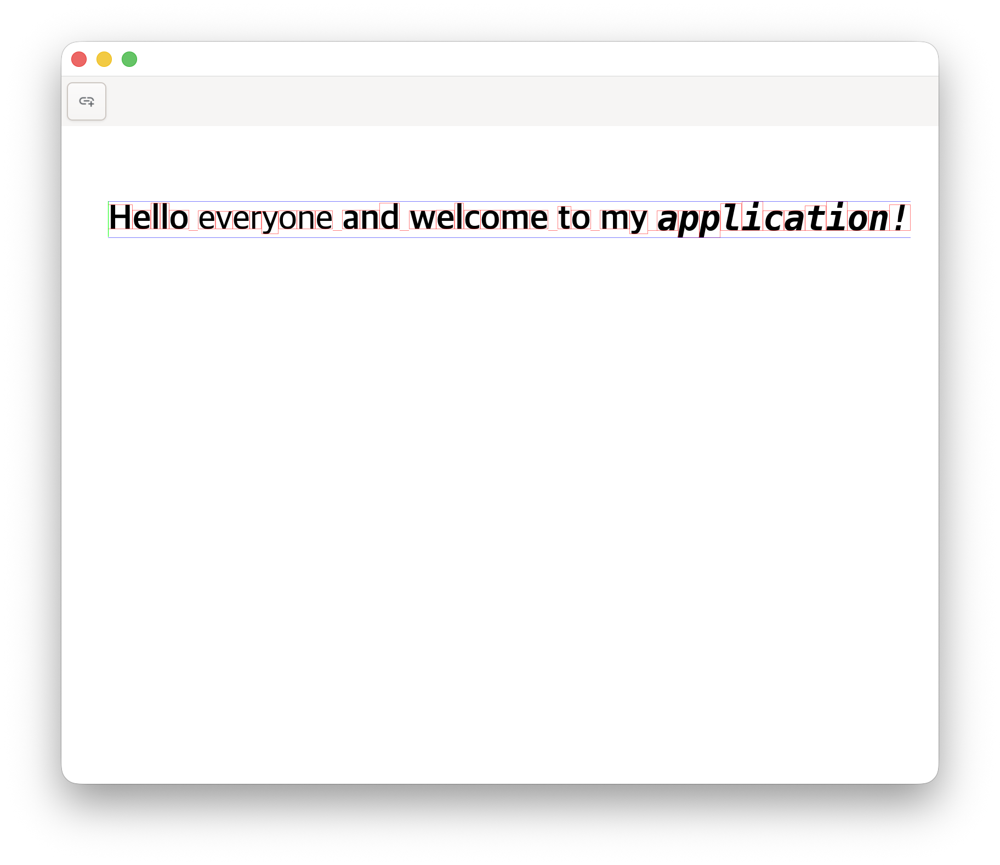
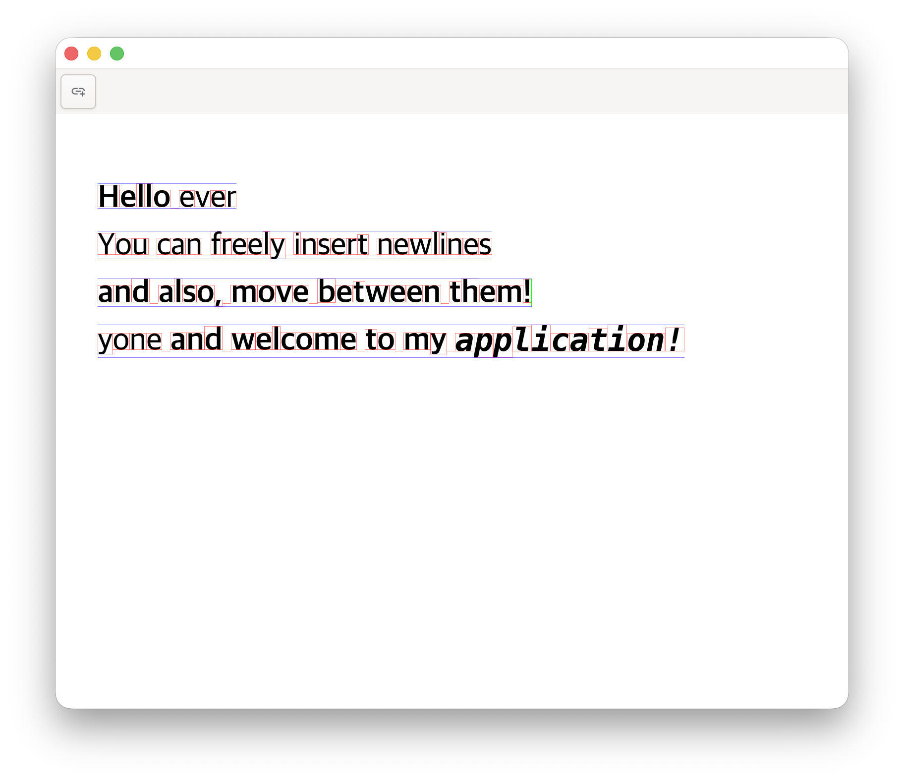

As a learning exercise, I implemented a document editor from scratch using GTK4 for windowing and Skia for GPU-accelerated rendering. The motivation was to understand how modern text editors handle complex layout requirements, bidirectional text, font fallback, glyph shaping, and sub-pixel positioning, without relying on web technologies or established frameworks like Electron. Traditional text editors either use platform-native text rendering (which limits control) or implement custom layout engines (which is complex). I chose the latter: building a complete text system adapted from `cosmic_text`, integrating it with Skia for rendering, and wrapping everything in a GTK4 application.

The project exposes fundamental challenges in text rendering that are often abstracted away by higher-level libraries. Text is not simply a sequence of characters; it is a complex interplay of Unicode normalization, font selection, glyph shaping via HarfBuzz, bidirectional reordering for languages like Arabic and Hebrew, and sub-pixel positioning for smooth rendering. Each of these steps can fail or produce unexpected results, and debugging requires understanding the full pipeline from UTF-8 bytes to rasterized pixels on screen. Rust's type system helps by catching layout bugs at compile time, but the core challenge remains: correctly implementing the Unicode text rendering algorithm while maintaining acceptable performance. The code is publicly available on [GitHub](https://github.com/ghovax/TextEditor).

### Architecture and Document Model

The editor is structured around a JSON-based document format that explicitly separates content from presentation. Each document contains global settings (margins, font size) and a list of elements, where each element is either a page or a line of styled text. Lines are defined by an anchor point in physical coordinates (millimeters or points) and a sequence of text spans, each with its own attributes. This format is deliberately minimal: there are no implicit formatting rules, no cascading styles, and no layout constraints beyond what the user explicitly specifies.

The document model is serialized and deserialized using `serde`, which provides compile-time guarantees that the JSON structure matches the Rust types. The `Document` struct contains fields for margins and font size, along with a vector of `DocumentElement` enum variants. Each line element includes an `anchor_point` tuple of floats and a `spans` vector of string-attribute pairs. The attributes currently support bold, italic, and font family selection, though the system is designed to be extensible to other properties like color, underline, and strikethrough.

Configuration is stored separately in `~/.editex/config.json` and includes window dimensions. On first launch, the editor creates this file with default values if it does not exist. This separation between document content and editor settings ensures that documents remain portable and independent of the user's environment.

### Text Rendering with Skia and Custom Text Layout

The rendering pipeline centers on Skia, a 2D graphics library used by Chromium and Android that provides GPU-accelerated drawing primitives. Unlike higher-level frameworks that abstract rendering into declarative descriptions, Skia requires explicit construction of drawing operations: create a surface, obtain a canvas, set paint properties, and issue draw commands. The editor creates a raster surface backed by CPU memory with dimensions scaled by the display's scale factor to support high-DPI screens. This surface is then wrapped by GTK4's `DrawingArea` widget, which calls the draw callback whenever the window needs repainting.

Text layout is handled by a custom text crate adapted from `cosmic_text`, a library originally developed for the COSMIC desktop environment. This crate provides several components: a `FontSystem` that manages font loading and fallback chains, a `LineBuffer` that holds text with attributes, and a `SwashCache` that rasterizes glyphs and caches the results. The layout process begins by populating a `LineBuffer` with text and attributes, then calling the layout function which performs font selection, glyph shaping via HarfBuzz, and bidirectional reordering. The output is a `LayoutedLine` containing positioned glyphs with physical offsets.

Each glyph stores its start and end indices into the original text string, its horizontal and vertical positions, its width, and metadata about bidirectional level. The physical positions are stored as `Option<f32>` because not all glyphs have valid positions (e.g., combining diacritics may be attached to base glyphs). The rendering loop iterates over these layouted glyphs, retrieves the rasterized glyph image from the cache, and draws it onto the Skia canvas at the specified position. This glyph-by-glyph approach provides precise control over rendering but requires careful handling of sub-pixel positioning and gamma correction.

### Cursor Positioning and Editing

One of the most technically challenging aspects was implementing accurate cursor positioning. When the user clicks in the text, the editor must determine which character the click corresponds to, accounting for variable-width glyphs, ligatures, and bidirectional text. The `EditingCursor` struct stores two indices: `line_index` for which line the cursor is on, and `glyph_index_in_line` for the character position within that line.

The cursor positioning algorithm iterates through all layouted lines to find which line the mouse Y-coordinate falls within, then iterates through the glyphs in that line to find which glyph horizontally contains the mouse X-coordinate. Each glyph exposes a `contains_horizontal_position` method that checks whether a given X-coordinate falls within its bounding box. For complex grapheme clusters (e.g., emoji with skin tone modifiers), the algorithm subdivides the glyph width proportionally based on the number of graphemes, allowing the cursor to be placed between individual graphemes within a cluster.

Bidirectional text complicates cursor movement because logical order (the order characters appear in memory) differs from visual order (the order they appear on screen). Hebrew text, for example, is stored left-to-right in memory but displayed right-to-left visually. The `level` field in each glyph indicates its bidirectional level, with even levels representing left-to-right and odd levels representing right-to-left. The cursor drawing code checks this level and adjusts the horizontal position accordingly, ensuring the cursor appears at the correct visual position regardless of text direction.

### GTK4 Integration and Event Handling

Integrating with GTK4 required understanding its event-driven architecture. GTK4 applications respond to user input through event controllers, which are attached to widgets and invoke callbacks when events occur. The editor uses a `GestureClick` controller for mouse clicks and an `EventControllerKey` for keyboard input. Each controller is configured with a priority and connected to a callback closure that captures the editor's state via `Rc<RefCell<T>>` smart pointers.

The mouse click handler calculates the physical mouse position by multiplying the widget-relative coordinates by the display scale factor, then calls the cursor positioning function described earlier. The result updates the shared `EditingCursor` state and queues a redraw by calling `drawing_area.queue_draw()`. This asynchronous redraw request ensures that the editor remains responsive even during complex layout operations, as GTK4 batches multiple redraw requests into a single frame.

Keyboard input is more complex because it must handle both character insertion and navigation commands. The key press handler checks the pressed key against constants for arrow keys, backspace, delete, and enter. For character keys, it retrieves the Unicode character from the key event and inserts it into the text at the cursor position. For navigation keys, it updates the cursor position based on the current line and glyph indices, wrapping to the previous or next line when appropriate. The implementation currently uses simple character-by-character navigation, though a more sophisticated editor would implement word-level and paragraph-level navigation.

### Font System and Glyph Rasterization

Font handling is delegated to the custom text crate's `FontSystem`, which wraps `fontdb` for font discovery and `rustybuzz` (a Rust port of HarfBuzz) for glyph shaping. On initialization, the font system scans standard font directories and builds a database of available fonts indexed by family name, weight, and style. When layout encounters a character, it queries the font database for the best matching font, prioritizing the requested family and style, then falling back to default fonts if no match is found.

Glyph shaping is the process of converting a sequence of Unicode characters into a sequence of positioned glyph IDs. This is necessary because characters and glyphs do not have a one-to-one correspondence: ligatures like "fi" may be rendered as a single glyph, while complex scripts like Devanagari may combine multiple characters into a single visual unit. HarfBuzz handles this complexity by applying font-specific shaping rules encoded in OpenType tables. The output is a list of glyph IDs with horizontal advances and offsets.

The `SwashCache` rasterizes glyphs by loading glyph outlines from the font file and rendering them into anti-aliased bitmaps. Each glyph is cached based on its font ID, glyph ID, and size, ensuring that repeated rendering of the same glyph reuses the cached bitmap. The cache uses an LRU eviction policy to prevent unbounded memory growth, though for typical documents with a few hundred unique glyphs, eviction rarely occurs. The rasterized bitmaps are stored in Skia-compatible RGBA format and uploaded to the canvas as image data.

### Challenges and Future Directions

One persistent challenge was debugging layout issues where text appeared at incorrect positions or with wrong metrics. The problem often stemmed from coordinate system mismatches: GTK4 uses widget-relative coordinates, Skia uses canvas-relative coordinates, and the text layout system uses font-relative coordinates (units per em). Ensuring correct transformations between these systems required careful tracking of scale factors and anchor points. To aid debugging, I implemented visual overlays that draw glyph bounding boxes and line metrics, allowing me to verify that layout calculations matched expectations.

Another challenge was achieving smooth scrolling performance. Initially, the editor re-layouted all text on every frame, which caused visible lag on documents with hundreds of lines. The solution was to cache layouted lines and only re-layout when the text content or window size changes. This optimization reduced frame times from 30ms to under 2ms for typical documents, enabling 60 FPS scrolling. Further optimizations could include incremental layout, where only visible lines are layouted, and dirty region tracking, where only changed regions are redrawn.

Future enhancements could include multi-page layout, where the document is divided into pages with automatic pagination; rich formatting options like colors, underlines, and custom fonts; and export to PDF using a similar approach to the textr library. The current implementation provides a solid foundation for these features by maintaining a clear separation between document structure, layout, and rendering. By understanding the full text rendering pipeline from first principles, I gained appreciation for the complexity hidden beneath seemingly simple operations like typing a character or moving the cursor.
