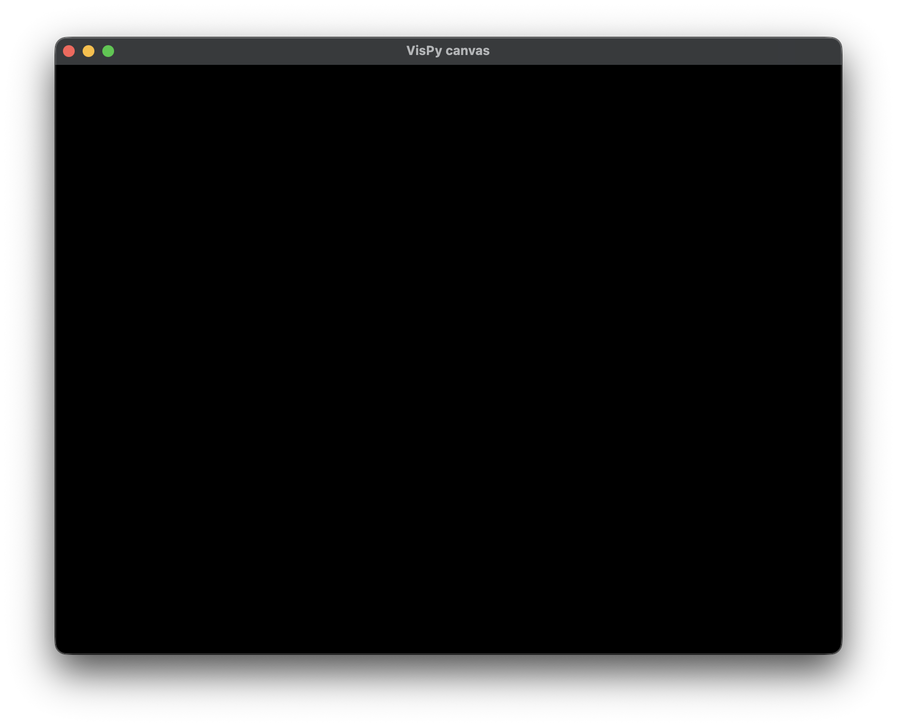

To practice my Python skills, I implemented a proof of concept for a game engine server that exposes a renderer and an entity-component-system (ECS) architecture through a RESTful API. Fundamentally, it manages state and orchestrates concurrent operations across subsystems for rendering, scripting, and networking, separating data (components) from behavior (systems) to keep the codebase modular and extensible. Flask is used for actor control and VisPy for GPU-accelerated rendering, with everything bundled into a monolithic application. As a proof of concept, it implements the essentials: a few API endpoints—one to create an entity, one to add a component to a given entity, and one to remove a given entity.

