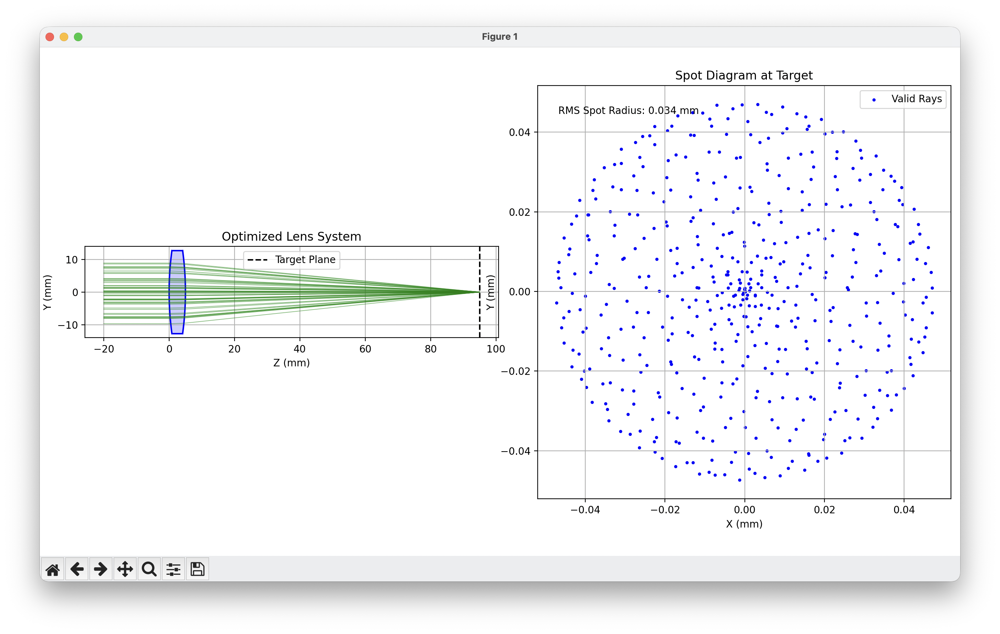

To better learn PyTorch, I set out to develop an optimization program that combines the physics of lenses with machine learning. The goal is to design the shape of a single glass lens that takes a given bundle of parallel incoming light rays and focuses them to a single, theoretically infinitesimal point on a screen at a specified distance.

### Physics of Ray Optics

Because the apertures have diameters hundreds of times larger than the wavelength of light, we operate in the regime of geometrical optics, which treats light as rays. The underlying assumption is that light travels in straight lines within a uniform medium and that each ray is independent, with no interactions between rays. Wave effects such as diffraction and interference are neglected because the lens features are large compared with the wavelength. However, we will apply the full Snell's law rather than the paraxial approximation, so the model remains accurate for rays at steep angles relative to the optical axis.

A light ray is mathematically represented by a vector with a given origin $\vec{P}_0 = (x_0, y_0, z_0)$ and a normalized direction $\vec{D} = (D_x, D_y, D_z)$ where $|\vec{D}| = 1$. The position along the ray can be parameterized by the distance $t$ traveled:

$$\vec{P}(t) = \vec{P}_0 + t \vec{D}$$

This parametric form is computationally convenient because finding where a ray intersects a surface reduces to solving for the scalar $t$.

A lens is defined by two spherical surfaces, each specified by its curvature $c = 1/R$ where $R$ is the radius of curvature. A positive curvature means the center of curvature lies in the $+z$ direction from the surface vertex. For a sphere centered at $(0, 0, R)$, the implicit equation $x^2+y^2+(z-R)^2=R^2$ can be solved for the sag (the z-displacement from the vertex):

$$z = R - \sqrt{R^2 - r^2}$$

where $r^2 = x^2 + y^2$. Rewriting in terms of curvature and rationalizing to avoid numerical instability when $c \to 0$:

$$z = \frac{c r^2}{1 + \sqrt{1 - c^2 r^2}}$$

This is the non-paraxial sag formula, valid for all ray heights. The paraxial approximation $z \approx \frac{c r^2}{2}$ is only accurate for small $r$.

To apply Snell's law at a surface, we need the normal vector. For a sphere centered at $\vec{C} = (0, 0, 1/c)$, the outward normal at any point $\vec{P}$ is simply:

$$\vec{N} = \frac{\vec{P} - \vec{C}}{|\vec{P} - \vec{C}|}$$

Snell's law states that when light passes between media with different refractive indices, it bends according to $n_1 \sin(\theta_1) = n_2 \sin(\theta_2)$. For computation, a vector form is more practical. We decompose the incident ray $\vec{D}_{inc}$ into components parallel and perpendicular to the surface:

$$\vec{D}_{inc} = \vec{D}_{\parallel} + \vec{D}_{\perp}$$

where $\vec{D}_{\perp} = (\vec{D}_{inc} \cdot \vec{N})\vec{N}$ and $\vec{D}_{\parallel} = \vec{D}_{inc} - \vec{D}_{\perp}$. The magnitudes relate to angles: $|\vec{D}_{\parallel}| = \sin\theta_1$ and $|\vec{D}_{\perp}| = \cos\theta_1$. With $\mu = n_1/n_2$, the refracted direction becomes:

$$ \vec{D}_{refr} = \mu \vec{D}_{inc} + \left(\mu \cos(\theta_1) - \cos(\theta_2)\right) \vec{N} $$

where $\cos(\theta_1) = -\vec{D}_{inc} \cdot \vec{N}$ and $\cos(\theta_2) = \sqrt{1 - \mu^2 (1 - \cos^2(\theta_1))}$.

A crucial edge case appears when the term inside this square root becomes negative. This occurs when light travels from a denser to a less dense medium at a sufficiently shallow angle—beyond the critical angle $\theta_c = \arcsin(n_2/n_1)$. For glass ($n \approx 1.5$) to air, $\theta_c \approx 41.8°$. Beyond this, Total Internal Reflection (TIR) occurs and the ray never exits the lens.

### The Computational Model

With the physics established, we can build an algorithm to trace rays through the lens. To properly sample the lens aperture, we need rays distributed uniformly across a circular cross-section. A naive approach using concentric rings creates artificial clustering. Instead, we use the Vogel spiral distribution: for $N$ rays indexed by $k$, the polar coordinates are $\phi_k = k \cdot \varphi$ and $r_k = R_{beam} \sqrt{k/N}$, where $\varphi = \pi(3 - \sqrt{5})$ is the golden angle. The $\sqrt{k/N}$ scaling ensures uniform area density since area grows as $r^2$. All initial ray directions are set to $\vec{D}_0 = (0, 0, 1)$ for a collimated beam.

The first step in tracing is determining where a ray hits a surface. For a differentiable implementation, an iterative Newton-Raphson method is more numerically stable than the closed-form quadratic solution and generalizes to arbitrary surface shapes. We seek the root of $f(t) = z(t) - z_{surface}(x(t), y(t)) = 0$, iterating $t_{n+1} = t_n - f(t_n)/f'(t_n)$. The derivative is:

$$f'(t) = D_z - \frac{c}{2\sqrt{1 - c^2 r^2}} \cdot 2(x D_x + y D_y)$$

Starting from an initial guess at the planar intersection, 3-5 iterations suffice for convergence.

The full ray-tracing algorithm proceeds as:

1. Find intersection $\vec{P}_1$ with front surface $S_1$ via Newton's method
2. Verify $x_1^2 + y_1^2 < R_{aperture}^2$ (ray hits the lens)
3. Compute normal $\vec{N}_1$, apply Snell's law to get refracted direction $\vec{D}_1$, check for TIR
4. Find intersection $\vec{P}_2$ with back surface $S_2$
5. Verify aperture, compute normal $\vec{N}_2$ (negated since we're exiting), apply Snell's law for $\vec{D}_2$
6. Propagate to target plane: $\vec{P}_{final} = \vec{P}_2 + t_{target} \vec{D}_2$ where $t_{target} = (z_{target} - z_2)/D_{2,z}$

A ray is valid if it passes all aperture checks, experiences no TIR, and $t_{target} > 0$.

### Optimization with PyTorch

We have three parameters—$c_1$, $c_2$, and $t_{lens}$—and a complex simulation mapping them to a spot size. How do we find optimal values? Brute-force search over continuous parameters is hopeless. Gradient descent is smarter: if we know how the spot size changes when we tweak each parameter, we can iteratively adjust them to reduce it. The quantity we need is the gradient:

$$\nabla L = \left( \frac{\partial L}{\partial c_1}, \frac{\partial L}{\partial c_2}, \frac{\partial L}{\partial t_{lens}} \right)$$

where $L$ is a loss function measuring lens quality. We define $L$ as the mean squared distance of ray endpoints from the origin:

$$ L(c_1, c_2, t_{lens}) = \frac{1}{K} \sum_{k=1}^{K} (x_k^2 + y_k^2) $$

This equals the squared RMS spot radius. We also add a penalty $\lambda(1 - f_{valid})$ to discourage configurations where rays undergo TIR.

Computing this gradient analytically would be nightmarish—our ray tracer involves Newton iterations, square roots, dot products in Snell's law, and averaging over thousands of rays. Writing $\frac{\partial L}{\partial c_1}$ by hand would require pages of chain rule. This is where PyTorch comes in. The key insight is that PyTorch tensors remember their computational history. With NumPy, `c = a * b` produces just a number. With PyTorch tensors that have `requires_grad=True`, `c` knows "I am the product of `a` and `b`." Every operation creates a tensor storing its value, references to input tensors, and which operation was used. This forms a computation graph. When we run our ray tracer with PyTorch tensors, we simultaneously compute the loss (the "forward pass") and build a graph recording how it was computed. Consider $L = (c_1 \cdot r^2)^2$. Letting $u = c_1 \cdot r^2$:

$$c_1 \xrightarrow{\times \, r^2} u \xrightarrow{(\cdot)^2} L$$

When we call `L.backward()`, PyTorch walks backward through this graph applying the chain rule:

$$\frac{\partial L}{\partial c_1} = \frac{\partial L}{\partial u} \cdot \frac{\partial u}{\partial c_1} = 2u \cdot r^2 = 2 c_1 r^4$$

For our full ray tracer, the graph contains hundreds of operations from Newton iterations, Snell's law, and averaging. PyTorch traverses it automatically, computing all gradients without us writing derivative code. One subtlety is that the derivative of $\sqrt{x}$ is $\frac{1}{2\sqrt{x}}$, which explodes as $x \to 0$. We use a regularized square root $\sqrt{\max(x, \epsilon)}$ with $\epsilon \approx 10^{-9}$ to bound gradients.

We mark parameters for optimization using `torch.nn.Parameter`, telling PyTorch to track computations involving them. The optimizer we use is Adam, which maintains adaptive per-parameter learning rates based on gradient statistics. It tracks exponential moving averages of gradients ($m_t$) and squared gradients ($v_t$), applying bias correction before updating:

$$\theta_{t+1} = \theta_t - \alpha \frac{\hat{m}_t}{\sqrt{\hat{v}_t} + \epsilon}$$

The optimization loop is: zero gradients, run forward pass (building the graph), compute loss, call `backward()` (computing gradients via chain rule), call `optimizer.step()` (updating parameters), repeat.

### Results

The optimization started with a symmetric biconvex lens: $R_1 = 100$ mm, $R_2 = -100$ mm, thickness $5$ mm. Initial loss was $0.1258$ (RMS spot radius $\sigma \approx 0.35$ mm). After 300 iterations, the loss dropped to $0.001126$ ($\sigma \approx 0.034$ mm)—a 100× improvement. The final parameters were $R_1 = 95.95$ mm, $R_2 = -94.51$ mm, thickness $4.99$ mm. The optimizer slightly increased both curvatures and reduced thickness. Valid rays remained at 100% throughout.

The solution reveals interesting physics. Starting symmetric ($|R_1| = |R_2|$), the optimizer converged to a slightly asymmetric configuration—its attempt to minimize spherical aberration. The Coddington shape factor $q = (R_2 + R_1)/(R_2 - R_1)$ shifted from $0$ to $-0.0076$. For a single lens focusing collimated light, theory predicts an asymmetric shape is optimal, and the optimizer discovered this independently.

The loss history shows characteristic dynamics: rapid exponential descent in early iterations as large gradients drive big steps, then slowing convergence as the minimum is approached, finally plateauing around iteration 150. Convergence in ~100 iterations (rather than thousands) demonstrates the efficiency of gradient-based optimization on smooth, differentiable problems.

The first figure shows a side view of the optimized lens with ray paths converging to a tight spot, alongside the spot diagram showing final $(x, y)$ positions on the target.

The loss history on a logarithmic scale reveals the exponential decrease followed by convergence—typical of gradient descent on smooth loss landscapes.
