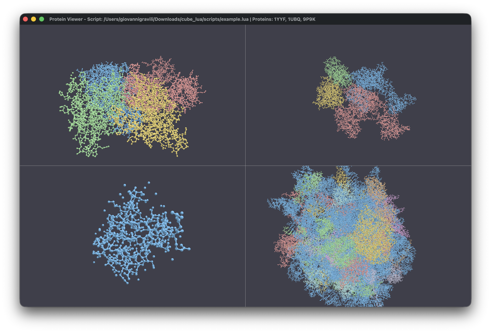

I built this molecular analysis toolkit in Rust because I wanted to move away from the clunky, legacy software often found in structural biology. The goal was to create a tool that feels more like a modern game engine, fast, interactive, and fully scriptable. By combining WGPU for GPU-accelerated rendering with a Lua logic layer, the toolkit handles real-time visualization alongside complex automated workflows.



### Parallelized Rendering and Viewport Management

One of the core features is the ability to manage multiple viewports in a single window. Unlike traditional viewers that force you into a single instance, this toolkit uses a flexible grid system. You can load an NMR structure with twenty different models and view them side-by-side, each with its own camera and representation settings. This is handled by a custom `WindowState` that manages a collection of `ViewportState` objects, recalculating aspect ratios and grid positions on the fly.

The rendering pipeline is implemented in WGSL, allowing the GPU to handle the heavy lifting of drawing thousands of atoms. You can toggle between several representation modes:

- **Space-filling (VDW):** Useful for understanding the physical volume of the protein.
- **Ball-and-Stick / Sticks:** Ideal for examining bonding patterns and active sites.
- **Backbone / Lines:** Simplifies the structure to focus on the overall fold.
- **Molecular Surfaces:** Real-time generation of solvent-excluded surfaces (SES) using a parallelized Marching Cubes algorithm.

### A Powerful Selection DSL

Navigating a protein with thousands of atoms requires a sophisticated way to isolate what matters. I implemented a custom Domain Specific Language (DSL) for atom selection. The parser takes queries and builds an abstract syntax tree (AST), which is then evaluated against the protein hierarchy.

The power of this system is best seen in spatial queries. For example, in the `example.lua` script, I use a proximity selection to find all atoms near Valine residues:

```lua
-- Complex spatial query: atoms within 5A of any Valine residue
local proximity_selection = reference_protein:select_atoms_by_query("within 5.0 of resn VAL")
print("Atoms within 5.0A of VAL residues: " .. proximity_selection:get_selected_atom_count())
```

You can also isolate structural features like helices or beta sheets:

```lua
local helix_selection = reference_protein:select_atoms_by_query("helix")
local sheet_selection = reference_protein:select_atoms_by_query("sheet")
```

### Scripting the Scientific Workflow

The integration of Lua via the `mlua` crate transforms the viewer into a programmable analysis platform. One of my favorite features is the hot-reloading capability. Using the `notify` crate, the application watches your Lua scripts for changes. The moment you save your script, the toolkit clears the state and re-runs the code, providing an instant feedback loop for developing complex analysis pipelines.

A typical script can automate tasks that would take hours in a GUI, such as aligning structures via the Kabsch algorithm:

```lua
-- Fetch structures from RCSB
local reference = pdb.fetch_protein_from_rcsb("1YYF")
local moving = pdb.fetch_protein_from_rcsb("1UBQ")

-- Select atoms for superposition
local query = "name CA and model 1"
local ref_sel = reference:select_atoms_by_query(query)
local moving_sel = moving:select_atoms_by_query(query)

-- Align structures using the Kabsch algorithm
moving:superimpose_onto_reference_structure(reference, moving_sel)

-- Calculate and report RMSD
local rmsd = moving:calculate_root_mean_square_deviation(reference, moving_sel)
print(string.format("Final Alignment RMSD: %.3f Å", rmsd))
```

### Depth of Analysis and Data Export

The toolkit isn't just a pretty renderer; it's a full-fledged structural analysis suite. Beyond visualization, you can extract quantitative data directly from the structures. In the example script, I demonstrate how to calculate geometric centers, SASA, and even extract specific sequences:

```lua
-- Protein Summary Data
local summary = reference_protein:get_summary_information()
print(string.format("Dimensions: %.1f x %.1f x %.1f A", summary.size.x, summary.size.y, summary.size.z))

-- SASA Calculation
local sasa_value = reference_protein:calculate_solvent_accessible_surface_area()
print("Total SASA: " .. string.format("%.2f", sasa_value) .. " A^2")

-- Distance between centroids of two selections
local sel1 = reference_protein:select_atoms_by_query("resi 1-10")
local sel2 = reference_protein:select_atoms_by_query("resi 20-30")
local dist = sel1:calculate_distance_to_other_selection(sel2)
```

Finally, the toolkit acts as a data bridge. It supports detecting hydrogen bonds, salt bridges, and generating Ramachandran dihedral data ($\phi$ and $\psi$ angles). All of this can be exported to standardized formats:

```lua
-- Data Export
reference_protein:export_analysis_report_to_json("analysis_report.json")
reference_protein:export_residue_data_to_csv("residues_data.csv")

-- FASTA Export
local fasta_data = reference_protein:generate_fasta_formatted_sequence()
```

By offloading the computational intensity to Rust and leveraging the GPU for visualization, this project provides a high-performance environment that bridges the gap between raw data and scientific insight.
