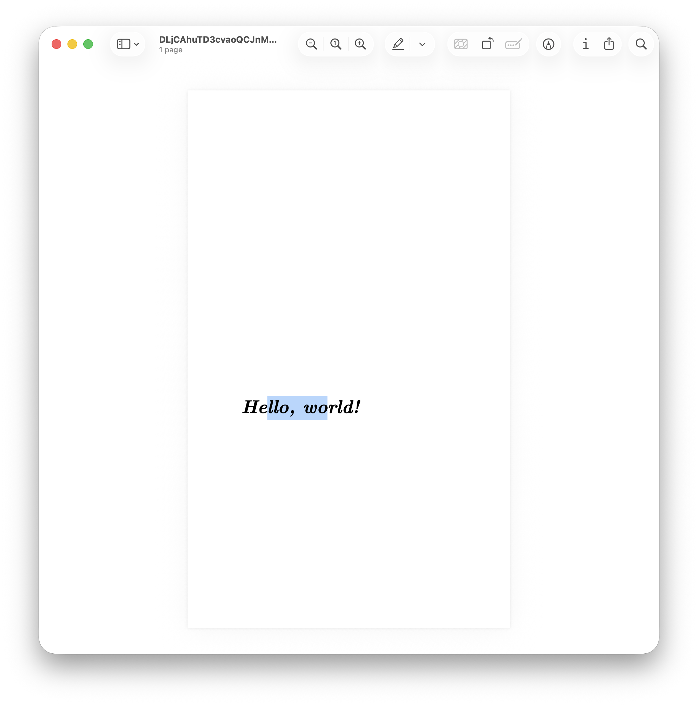

This project began as an exam assignment for my bachelor's but evolved into a full-fledged undertaking: implementing a PDF generator from scratch that produces files from a predefined custom JSON document format. Before I knew about tools like Pandoc, it was instructive to read the PDF specification and implement it directly. The main challenge is that PDF is a binary format requiring precise encoding of every detail, font metrics, glyph mappings, character positioning, and page structure, so readers can decode it. The format is deceptively complex, with interacting layers such as object references, stream encoding, and resource dictionaries that must align perfectly for valid files.

Rust was ideal for this project because its strong type system catches many errors at compile time, and the ecosystem provides excellent libraries for the low-level operations required. The implementation relies on three core dependencies: `lopdf` for low-level PDF object manipulation and document structure, `owned_ttf_parser` for parsing TrueType font files and extracting glyph metrics, and `serde` with `serde_json` for deserializing the JSON document format into strongly-typed Rust structs. Additional libraries like `nalgebra-glm` handle matrix transformations for image positioning, though image support remains partially implemented.

My goal was not only to generate PDFs but to produce deterministic, byte-for-byte identical documents for reliable testing, which requires controlling generation parameters via low-level APIs and converting to PostScript. The code is fully publicly available, thoroughly documented, and published on [GitHub](https://github.com/ghovax/PDF-Renderer) and [crates.io](https://crates.io/crates/textr) at these links. This project has had a total of 9,000 downloads.

The library provides both a command-line interface for generating PDFs and a high-level API, which was used specifically to create the following example. The resulting PDF is available at the following [link](https://github.com/ghovax/PDF-Renderer/blob/master/assets/pdfs/DLjCAhuTD3cvaoQCJnMvkC0iNWEGEfyD.pdf?raw=true). As you can see in the following screenshot, the text can be correctly highlighted using a standard PDF reader, demonstrating the validity of the output.



### Implementation

This challenge quickly became extremely complex. The text files must be loaded and embedded within the PDF starting from the original TTF font file, with a complete character-to-glyph mapping and proper Unicode support. Text positioning must be specified in millimeters and converted to PDF points, and pages must be created with customizable dimensions. All of this must be driven through a high-level interface, a JSON file that is deserialized at runtime to produce the input for PDF generation.

The architecture is divided into two layers: the high-level `Document` struct that represents the JSON format, and the low-level `PdfDocument` struct that interfaces directly with `lopdf`. The `Document` provides a `to_pdf()` method that automatically loads fonts from the Computer Modern Unicode (CMU) family, the same fonts used in LaTeX, and converts each operation in the JSON into corresponding PDF operations. This separation allows users to either work with the simple JSON format or bypass it entirely and use the `PdfDocument` API for fine-grained control over PDF generation.

The high-level JSON interface defines the sequence of operations required to generate a PDF. It initializes the page with the specified width and height in millimeters, then executes text operations within that page. Text is placed by specifying its RGB color, the position in millimeters measured from the bottom-left corner, the content to be written, the font size, and the font index to use. Fonts are currently loaded by default by the program because external font loading is not yet fully implemented; available choices include typewriter, sans-serif, bold, standard, and Roman from the Latin Modern family used in LaTeX documents. Additionally, the document ID and the instance ID must be specified. These two parameters are required to uniquely identify a document and to enable reproducible billing. They can be provided manually by the user. The font loading order is determined by sorting the paths so the font indices remain consistent across runs.

```json
{
  "documentId": "QU2KK7yivMeRDnU8DodEQxnfqJAe4wZ2",
  "instanceId": "DLjCAhuTD3cvaoQCJnMvkC0iNWEGEfyD",
  "operations": [
    {
      "pageWidth": 210.0,
      "pageHeight": 297.0
    },
    {
      "color": [0.0, 0.0, 0.0],
      "position": [50.0, 200.0],
      "textString": "Hello, world!",
      "fontSize": 48.0,
      "fontIndex": 0
    }
  ]
}
```

I'm betting that TrueType fonts in PDFs are complicated because the PDF specification predates Unicode. PDFs use character IDs (CIDs) and CID fonts, which map 16-bit glyph IDs to Unicode code points via a CMAP (character map). The process involves parsing the TTF file to extract the ascent and descent in font units per em, extracting glyph-to-Unicode mappings from the font's CMAP table, calculating glyph widths for proper text spacing, and generating a CID-to-Unicode CMAP for text extraction.

Font parsing begins by loading the TTF file bytes and constructing an `OwnedFace` using the `owned_ttf_parser` library. This face provides access to the font's internal tables, including the CMAP table that maps Unicode codepoints to glyph indices. The implementation iterates through all Unicode-compatible subtables in the CMAP, filtering for entries with positive glyph indices and building a `HashMap<u16, char>` that associates each glyph ID with its corresponding Unicode character. This mapping is essential for text extraction and search functionality in PDF readers.

The glyph metrics determine character widths for spacing and the horizontal advance, the distance to move the cursor before drawing the glyph. For each glyph, the implementation queries the font face for its horizontal advance width and bounding box. The height is calculated by subtracting the font's descender from the glyph's vertical extent, ensuring consistent baseline alignment. The horizontal advance is scaled from font units to a default 1000-unit square using a normalization formula, which places all fonts in the same coordinate space and simplifies PDF layout calculations:

$$\text{scaled width} = \frac{\text{glyph width} \times 1000}{\text{units per em}}$$

After loading the fonts and preparing the groundwork, the next step is to write to a given PDF layer by constructing a sequence of PDF operators, drawing commands that the renderer executes; this also requires understanding that PDF points relate to millimeters by a specific conversion:

$$\text{points} = \text{millimeters} \times 2.834646$$

This factor derives from the definition of points in relation to inches.

### PDF Layer System and Low-Level Operations

The PDF generation process centers around `lopdf`, a Rust library that provides low-level access to PDF object structure. Unlike higher-level libraries that abstract away PDF internals, `lopdf` requires explicit construction of PDF objects, dictionaries, and streams. Each page in the document contains one or more layers (content streams) that hold sequences of PDF operations such as `Tm` (set text matrix), `Tf` (set font), and `Tj` (show text). The `PdfLayer` struct wraps a vector of these operations, which are later encoded into a compressed or uncompressed stream depending on configuration.

Text rendering requires setting the text state before each string of characters. This involves calculating the text matrix that positions text at the specified coordinates, selecting the font and size via the font resource dictionary, and setting the RGB color using the `rg` operator. The implementation normalizes all text to Unicode NFC (Canonical Decomposition followed by Canonical Composition) before rendering to ensure consistent glyph selection across different input sources. Each text operation is appended to the current layer's operation vector, and when the page is finalized, these operations are encoded into the page's content stream.

To generate a document from scratch using this library, use the following high-level API (as per the example):

```rust
// Create a new document with a predefined document ID
let document_id = "QU2KK7yivMeRDnU8DodEQxnfqJAe4wZ2".to_string();
let mut pdf_document = PdfDocument::new(document_id);
// Add a page of 300 by 500 millimeters with an empty layer
let (page_index, layer_index_in_page) = pdf_document.add_page_with_layer(300.0, 500.0);

// Add a font to the document, in this case it is the bold italic font of the CMU family
let font_path = Path::new("fonts/computer-modern/cmunbi.ttf");
let font_index = pdf_document.add_font(font_path).unwrap();

// Write some text to the current page at the current layer
pdf_document
    .write_text_to_layer_in_page(
        page_index,
        layer_index_in_page,
        [0.0, 0.0, 0.0],
        "Hello, world!".into(),
        font_index,
        48.0,
        [50.0, 200.0],
    )
    .unwrap();

// Because we are not working with a `Document`, but instead with a `PdfDocument` we need
// to first save the PDF document to bytes and then to a file
let instance_id = "DLjCAhuTD3cvaoQCJnMvkC0iNWEGEfyD".to_string();
pdf_document.optimize();
pdf_document.write_all(instance_id.clone()).unwrap();
let pdf_document_bytes = pdf_document.save_to_bytes().unwrap();
```

### Deterministic Output for Testing

The library focuses on producing byte-identical PDFs every time to enable regression testing by comparing PDFs after code changes. Traditional PDF libraries use random UUIDs for document IDs and timestamps in metadata, which makes output non-deterministic. To achieve determinism, the implementation requires users to provide both a `document_id` and an `instance_id` as input parameters. These identifiers replace the random UUIDs typically used in PDF metadata, ensuring that identical inputs always produce identical outputs.

Beyond explicit identifiers, achieving true determinism required eliminating subtle sources of randomness throughout the codebase. One major source was iteration order over `HashMap` collections, which is non-deterministic in Rust. Switching to `BTreeMap` for font resources and object dictionaries ensures consistent ordering based on keys. Another source was the `time` crate's timestamp generation, which had to be controlled by accepting creation dates as parameters rather than querying the system clock. Even the order of font loading matters: the implementation sorts font file paths before loading to ensure font indices remain consistent across runs.

The testing methodology generates fuzz targets, random JSON documents, converts them to PDFs as reference outputs, converts those PDFs to PostScript for easier text-based diffing using Ghostscript, and then reconverts after code changes to verify diffs against the references. Binary PDF diffs show raw byte changes without context, whereas PostScript diffs are human-readable and reveal structural changes. The conversion to PostScript uses the command `gs -sDEVICE=ps2write -o output.ps input.pdf`, which produces a text representation of the PDF's drawing operations.

The PDFs my library generates are functional but unoptimized: they contain redundant objects and uncompressed streams, making files large, usually a few megabytes even for simple documents because all font files are embedded in their entirety. The `optimize()` method compresses streams and removes duplicate objects, typically reducing file sizes by 80–90%. This optimization maintains determinism because it applies transformations in a fixed order based on sorted object IDs.

The test outputs have not been included in the repository because they are quite large, about half a gigabyte, due to redundant PDFs and PostScript files that are not optimized by Ghostscript for verification reasons. Each test generates both a PDF and its PostScript equivalent, and with hundreds of fuzz targets, the storage requirements become prohibitive for version control.
